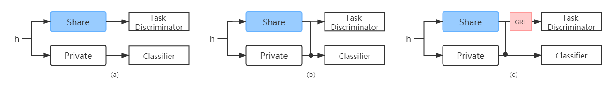

# AT4MTL
Adversarial Training for Multi-Task Learning

| Type | (a) | (b) | (c) |
| Avg Err | 0.1585 | 0.1462 | 0.1312 |

Paper: [Adversarial Multi-task Learning for Text Classification](https://www.aclweb.org/anthology/P17-1001.pdf)
Dataset: [Download](https://pan.baidu.com/s/1c2L6vdA)
Glove-200d: [Visit](https://nlp.stanford.edu/projects/glove/)
